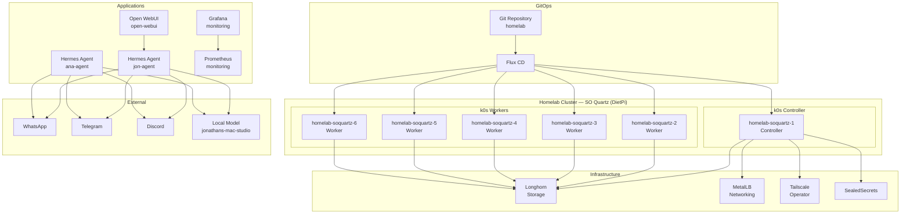

# Homelab

A 6-node Kubernetes homelab running k0s on SO Quartz devices, managed via GitOps with Flux CD.

## Architecture

```mermaid
graph TB
    subgraph "Homelab Cluster — SO Quartz (DietPi)"
        subgraph "k0s Controller"
            C1[homelab-soquartz-1<br/>Controller]
        end
        subgraph "k0s Workers"
            W1[homelab-soquartz-2<br/>Worker]
            W2[homelab-soquartz-3<br/>Worker]
            W3[homelab-soquartz-4<br/>Worker]
            W4[homelab-soquartz-5<br/>Worker]
            W5[homelab-soquartz-6<br/>Worker]
        end
    end

    subgraph "GitOps"
        REPO[Git Repository<br/>homelab]
        FLUX[Flux CD]
    end

    subgraph "Infrastructure"
        LS[Longhorn<br/>Storage]
        ML[MetalLB<br/>Networking]
        TS[Tailscale<br/>Operator]
        SS[SealedSecrets]
    end

    subgraph "Applications"
        HERMES_J[Hermes Agent<br/>jon-agent]
        HERMES_A[Hermes Agent<br/>ana-agent]
        OW[Open WebUI<br/>open-webui]
        PROM[Prometheus<br/>monitoring]
        GRAF[Grafana<br/>monitoring]
    end

    subgraph "External"
        WA[WhatsApp]
        TG[Telegram]
        DC[Discord]
        MODEL[Local Model<br/>jonathans-mac-studio]
    end

    REPO --> FLUX
    FLUX --> C1
    FLUX --> W1
    FLUX --> W2
    FLUX --> W3
    FLUX --> W4
    FLUX --> W5

    C1 --> LS
    C1 --> ML
    C1 --> TS
    C1 --> SS

    W1 --> LS
    W2 --> LS
    W3 --> LS
    W4 --> LS
    W5 --> LS

    HERMES_J --> WA
    HERMES_J --> TG
    HERMES_J --> DC
    HERMES_J --> MODEL
    HERMES_A --> WA
    HERMES_A --> TG
    HERMES_A --> DC
    HERMES_A --> MODEL

    OW --> HERMES_J
    GRAF --> PROM
```

## Quick Start

1. **Burn DietPi images** to MicroSD cards for each node using `setup/burn-url-to-device.sh`
2. **Boot nodes** and configure network access
3. **Deploy the cluster** with `k0sctl apply`
4. **Bootstrap Flux CD** to start GitOps management

See the [Setup Guide](docs/setup-guide.md) for detailed instructions.

## Cluster

| Node                  | Role     | OS     |
|-----------------------|----------|--------|
| homelab-soquartz-1    | controller | DietPi |
| homelab-soquartz-2    | worker   | DietPi |
| homelab-soquartz-3    | worker   | DietPi |
| homelab-soquartz-4    | worker   | DietPi |
| homelab-soquartz-5    | worker   | DietPi |
| homelab-soquartz-6    | worker   | DietPi |

- **Orchestration:** k0s (single-binary Kubernetes)
- **CNI:** Kuberouter
- **Provisioning:** k0sctl

[Read more about the cluster setup](docs/setup-guide.md#step-3-deploy-k0s-cluster)

## Overview

GitOps-managed Kubernetes cluster with Tailscale for external access and Longhorn for distributed storage. Flux CD continuously reconciles cluster state from this repository.

[Full architecture details →](docs/architecture.md)

## What's Running

| App        | Namespace    | Description                                    | Access         |
|------------|-------------|------------------------------------------------|----------------|
| Hermes (jon) | jon-agent  | AI agent with WhatsApp/Telegram/Discord integrations | ClusterIP    |
| Hermes (ana) | ana-agent  | AI agent (second instance)                     | ClusterIP      |
| Open WebUI | open-webui  | Web UI for LLM interaction, backed by Hermes   | Tailscale      |
| Prometheus | monitoring  | Metrics collection and storage                 | ClusterIP      |
| Grafana    | monitoring  | Metrics visualization dashboard                | Tailscale      |

[Full app reference →](docs/apps.md)

## Infrastructure

| Component      | Namespace      | Purpose                              |
|---------------|----------------|--------------------------------------|
| Longhorn      | longhorn-system| Distributed block storage            |
| MetalLB       | metallb-system | Layer 2 load balancer (fallback)     |
| Tailscale     | tailscale      | External access via Tailnet          |
| SealedSecrets | flux-system    | Encrypted secrets for Git            |

[Full infrastructure reference →](docs/infrastructure.md)

## GitOps

Flux CD watches this repository and automatically applies all Kubernetes manifests. Changes to `flux/` are deployed within minutes of being pushed.

- **Source:** `flux/cluster/kustomization.yaml`
- **Apps:** `flux/apps/`
- **Infrastructure:** `flux/infra/`

[GitOps flow details →](docs/architecture.md#gitops-flow)

## CI/CD

GitHub Actions builds the custom Hermes Docker image from `Dockerfile.hermes`.

[Workflow: `.github/workflows/hermes-image.yml`](.github/workflows/hermes-image.yml)

## Docs

- [Setup Guide](docs/setup-guide.md) — Image burning, node setup, k0s deployment, Flux bootstrap
- [Architecture](docs/architecture.md) — Full architecture with diagrams and data flow
- [Apps Reference](docs/apps.md) — Detailed reference for all deployed applications
- [Infrastructure Reference](docs/infrastructure.md) — Storage, networking, secrets, Helm repos
