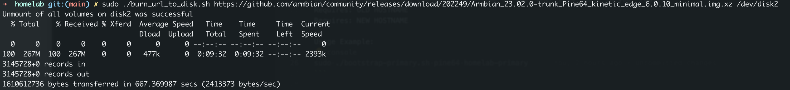

# Kubernetes Homelab with DietPi Debian linux
This Kubernetes project contains setup scripts for the cluster environment and is intended for home use on homelab clusters.  The setup scripts assume you are using an Ubuntu or at least Debian based build.  At the time of initial commit these scripts were used with Kinetic minimal builds from DietPi.

## Setup Cluster
### setup/burn-url-to-device.sh
Use to burn an image from a url to a tarket device (EG: MicroSD)

* Optional: IMAGE URL
* Optional: DEVICE PATH
* Optional: HOSTNAME
* Optional: PASSWORD
* Optional: EJECT Y/N

Usage:
```console
sudo ./setup/burn-url-to-device.sh https://dietpi.com/downloads/images/DietPi_SOQuartz-ARMv8-Trixie.img.xz /dev/disk7 HOSTNAME PASSWORD n
```



After burning the image, boot the node and log in to configure it for your cluster.
