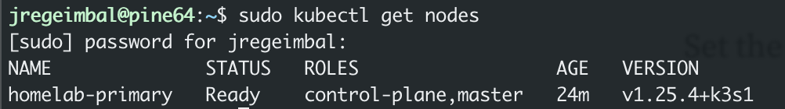

# Kubernetes K3s Homelab with Armbian Ubuntu
This Kubernetes project contains setup scripts for K3s env and is intended for home use on homelab clusters.  The setup scripts assume you are using an Ubuntu or at least Debian based build.  At the time of initial commit these scripts were used with Kinetic minimal builds from Armbian.

## Setup Cluster
### setup/burn-url-to-device.sh
Use to burn an image from a url to a tarket device (EG: MicroSD)

* Requires: IMAGE URL
* Requires: DEVICE PATH

Usage:
```console
sudo ./burn_url_to_disk.sh https://github.com/armbian/community/releases/download/202249/Armbian_23.02.0-trunk_Pine64_kinetic_edge_6.0.10_minimal.img.xz /dev/disk2
```


Before following either of the following options, you need to login to the node. Load the MicroSD card whichever device will be your Kubernetes primary node and boot it up. If you're using the Armbian minimal community images like suggested, connect to it as root@<machine-ip>, enter `1234` for the password when prompted. You will then be prompted to create a new user, password, and a few other things.

### setup/bootstrap-primary.sh
Use it to install Docker and K3s primary (master) and to change the hostname.  If you do change the hostname, make sure you change the hostname in your DHCP IPv4 table in your router.

* Requires: OLD HOSTNAME
* Requires: NEW HOSTNAME

Usage:
```console
sudo ./bootstrap-primary.sh pine64 homelab-primary
```


I wouldn't suggest pulling this repo into the primary.  Instead, copy this file into the primary or copy and paste it's contents and modify the arguments.

### setup/bootstrap-worker.sh
Use it to install Docker and K3s worker node, requires an OLD HOSTNAME, NEW HOSTNAME, K3s_URL, and K3s_TOKEN

* Requires: OLD HOSTNAME
* Requires: NEW HOSTNAME
* Requires: K3S URL
* Requires: K3s Token

Usage:
```console
sudo ./bootstrap-worker.sh pine64 homelab-pine64-01 https://homelab-primary:6443 123456789
```

Again, wouldn't suggest pulling this repo into the worker.  Instead, copy this file into the worker or copy and paste it's contents and modify the arguments.
