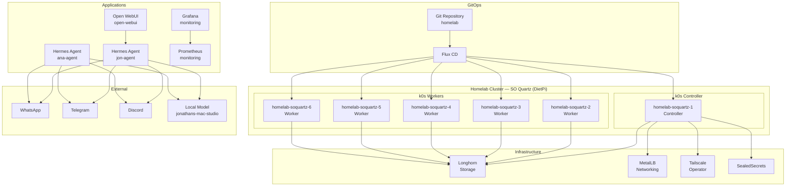

# Update README for Homelab

## Overview

Update the README.md to accurately reflect the current state of the homelab project, which has evolved significantly from its original purpose. The current README only describes the setup image-burning script and assumes Ubuntu/Debian, while the actual homelab is a 6-node k0s Kubernetes cluster on SO Quartz devices managed by Flux CD with multiple applications deployed.

## Goals

- Provide an accurate, comprehensive overview of the homelab in the root README
- Include a visual architecture diagram showing cluster topology
- Organize detailed information into separate docs with clear navigation
- Replace outdated references (Ubuntu, Kinetic) with current stack details

## Current State

### Cluster
- **Orchestration:** k0s (single-binary Kubernetes)
- **Nodes:** 6x SO Quartz devices running DietPi (Debian)
  - 1 controller node (`homelab-soquartz-1`)
  - 5 worker nodes (`homelab-soquartz-2` through `homelab-soquartz-6`)
- **CNI:** Kuberouter
- **Provisioning:** k0sctl

### GitOps
- **Tool:** Flux CD
- **Pattern:** GitOps — Flux watches this repo and applies all Kustomizations
- **Structure:**
  - `flux/cluster/` — cluster-level resources (namespaces, HelmRepositories, apps entrypoint)
  - `flux/infra/` — infrastructure components (Longhorn, MetalLB, Tailscale, SealedSecrets)
  - `flux/apps/` — application deployments (Hermes agents, Open WebUI, monitoring)

### Infrastructure
- **Storage:** Longhorn (distributed block storage)
- **Networking:** MetalLB + Tailscale Operator (external IPs via Tailscale network)
- **Secrets:** SealedSecrets (encrypted secrets committed to repo)

### Applications
- **Hermes Agents** — Two instances (`jon-agent`, `ana-agent`) using the Hermes Agent framework
  - Connected via WhatsApp, Telegram, Discord
  - STT enabled with faster-whisper
  - Browser automation via Browserless Chromium
  - Local model inference via Open WebUI
- **Open WebUI** — Web UI for LLM interaction, configured to use Hermes as the backend API
- **Monitoring** — Prometheus + Grafana stack for cluster observability

### CI/CD
- **GitHub Actions** — Workflow to build the Hermes Docker image (`Dockerfile.hermes`)

### Supporting Files
- `Dockerfile.hermes` — Custom Hermes agent image build
- `k0sctl.yaml` — k0s cluster deployment configuration
- `assets/grafana-dashboards/` — Custom Grafana dashboard JSON
- `images/u-boot-rockchip.bin` — U-Boot bootloader binary for SO Quartz
- `secrets/encrypted/` — SealedSecrets CRD and encrypted secrets

## Design

### README.md Structure

```
# Homelab

[1-line description]

[Architecture diagram - Mermaid]

## Quick Start
[Setup steps with links to docs]

## Cluster
[Overview table: nodes, OS, roles]

## Architecture
[High-level description, link to full architecture doc]

## What's Running
[Apps table: name, namespace, description, link to details]

## Infrastructure
[Infra table: component, purpose, link to details]

## GitOps
[Flux CD description, link to architecture doc]

## Docs
- [Setup Guide](docs/setup-guide.md)
- [Architecture](docs/architecture.md)
- [Apps Reference](docs/apps.md)
- [Infrastructure Reference](docs/infrastructure.md)
```

### Docs Folder Structure

Create `docs/` at the repo root with:

1. **`docs/setup-guide.md`** — Step-by-step setup:
   - Image preparation (burn-url-to-device.sh usage)
   - Node provisioning (DietPi setup)
   - k0s cluster deployment (k0sctl)
   - Flux CD bootstrapping

2. **`docs/architecture.md`** — Full architecture:
   - Cluster topology diagram
   - Networking (Kuberouter, MetalLB, Tailscale)
   - Storage (Longhorn)
   - GitOps flow (Flux CD watch cycle)
   - Secret management (SealedSecrets)
   - App communication flows

3. **`docs/apps.md`** — Application reference:
   - Hermes agents (config, integrations, architecture)
   - Open WebUI (configuration, model routing)
   - Monitoring stack (Prometheus, Grafana)

4. **`docs/infrastructure.md`** — Infrastructure reference:
   - k0s cluster configuration
   - Longhorn setup
   - MetalLB configuration
   - Tailscale Operator setup
   - SealedSecrets workflow

### Architecture Diagram (Mermaid)



## Implementation Plan

1. Create `docs/` directory with four markdown files
2. Rewrite `README.md` with new structure
3. Remove outdated content (Ubuntu references, outdated setup description)
4. Add Mermaid architecture diagram
5. Create tables for cluster, apps, and infrastructure
6. Ensure all internal links between README and docs work

## Out of Scope

- Changes to any `flux/` manifests
- Changes to `secrets/` or encryption workflow
- Changes to CI/CD workflows
- Changes to setup scripts
